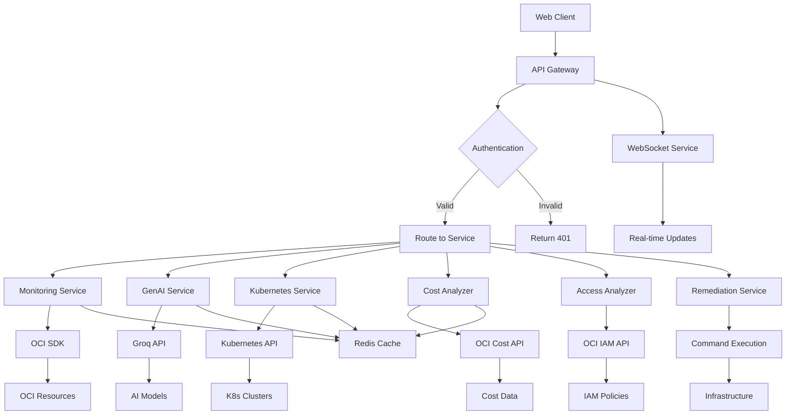
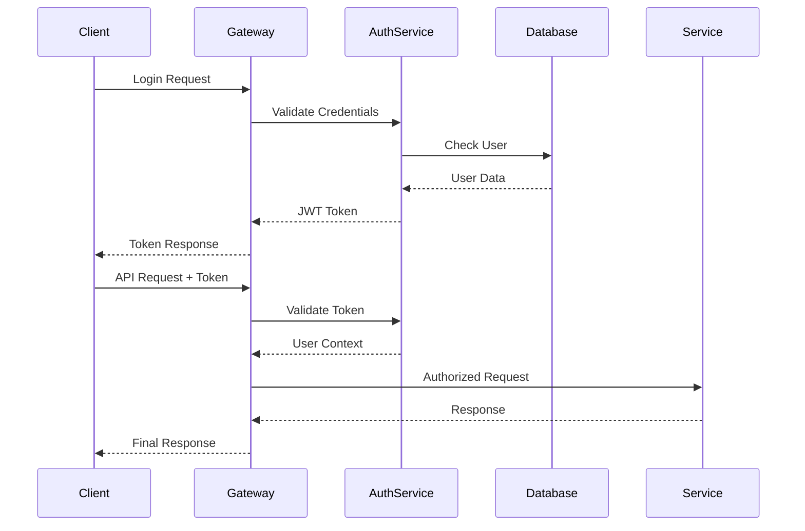

# 🏗️ Architecture Guide

## Overview

The GenAI CloudOps Dashboard follows a modern microservices architecture designed for scalability, maintainability, and extensibility. This document provides a comprehensive overview of the system architecture, component interactions, and design principles.

## System Architecture

### High-Level Architecture

```
┌─────────────────────────────────────────────────────────────────────────────┐
│                              Client Layer                                   │
│  ┌─────────────────────┐  ┌─────────────────────┐  ┌─────────────────────┐  │
│  │   Web Dashboard     │  │   Mobile Apps       │  │   CLI Tools         │  │
│  │   (React + TS)      │  │   (Future)          │  │   (Future)          │  │
│  └─────────────────────┘  └─────────────────────┘  └─────────────────────┘  │
└─────────────────────────────────────────────────────────────────────────────┘
                                      │ HTTPS/WSS
┌─────────────────────────────────────────────────────────────────────────────┐
│                           API Gateway Layer                                 │
│  ┌─────────────────────────────────────────────────────────────────────┐   │
│  │                      Unified API Gateway                            │   │
│  │  ┌─────────────┐ ┌─────────────┐ ┌─────────────┐ ┌─────────────┐   │   │
│  │  │    Auth     │ │ Rate Limit  │ │   Routing   │ │   Metrics   │   │   │
│  │  │  Middleware │ │ Middleware  │ │  Middleware │ │ Middleware  │   │   │
│  │  └─────────────┘ └─────────────┘ └─────────────┘ └─────────────┘   │   │
│  └─────────────────────────────────────────────────────────────────────┘   │
└─────────────────────────────────────────────────────────────────────────────┘
                                      │
┌─────────────────────────────────────────────────────────────────────────────┐
│                         Microservices Layer                                 │
│  ┌─────────────┐ ┌─────────────┐ ┌─────────────┐ ┌─────────────────────┐   │
│  │   GenAI     │ │ Monitoring  │ │ Kubernetes  │ │   Notification      │   │
│  │  Service    │ │   Service   │ │   Service   │ │     Service         │   │
│  └─────────────┘ └─────────────┘ └─────────────┘ └─────────────────────┘   │
│  ┌─────────────┐ ┌─────────────┐ ┌─────────────┐ ┌─────────────────────┐   │
│  │    Cost     │ │   Access    │ │ Remediation │ │     Chatbot         │   │
│  │  Analyzer   │ │  Analyzer   │ │   Service   │ │     Service         │   │
│  └─────────────┘ └─────────────┘ └─────────────┘ └─────────────────────┘   │
│  ┌─────────────┐ ┌─────────────┐ ┌─────────────┐ ┌─────────────────────┐   │
│  │ Prometheus  │ │   Grafana   │ │ WebSocket   │ │     Vault           │   │
│  │  Metrics    │ │ Integration │ │  Service    │ │    Service          │   │
│  └─────────────┘ └─────────────┘ └─────────────┘ └─────────────────────┘   │
└─────────────────────────────────────────────────────────────────────────────┘
                                      │
┌─────────────────────────────────────────────────────────────────────────────┐
│                           Data & Cache Layer                                │
│  ┌─────────────┐ ┌─────────────┐ ┌─────────────┐ ┌─────────────────────┐   │
│  │ PostgreSQL  │ │    Redis    │ │   SQLite    │ │    In-Memory        │   │
│  │ (Production)│ │   (Cache)   │ │ (Default)   │ │     Cache           │   │
│  └─────────────┘ └─────────────┘ └─────────────┘ └─────────────────────┘   │
└─────────────────────────────────────────────────────────────────────────────┘
                                      │
┌─────────────────────────────────────────────────────────────────────────────┐
│                           External Services                                 │
│  ┌─────────────┐ ┌─────────────┐ ┌─────────────┐ ┌─────────────────────┐   │
│  │     OCI     │ │   Groq AI   │ │ Kubernetes  │ │    Prometheus       │   │
│  │  Resources  │ │     API     │ │   Cluster   │ │     & Grafana       │   │
│  └─────────────┘ └─────────────┘ └─────────────┘ └─────────────────────┘   │
│  ┌─────────────┐ ┌─────────────┐ ┌─────────────┐ ┌─────────────────────┐   │
│  │    SMTP     │ │    Slack    │ │  Terraform  │ │     OCI CLI         │   │
│  │   Server    │ │    API      │ │   Provider  │ │     Commands        │   │
│  └─────────────┘ └─────────────┘ └─────────────┘ └─────────────────────┘   │
└─────────────────────────────────────────────────────────────────────────────┘
```

### Component Interaction Flow



## Core Components

### 1. Frontend Layer

#### React Application
- **Technology**: React 18+ with TypeScript
- **State Management**: React Query for server state, Context API for client state
- **Styling**: Tailwind CSS with custom components
- **Build Tool**: Vite for fast development and builds
- **Testing**: Jest + React Testing Library

#### Key Features
- **Responsive Design**: Mobile-first approach with breakpoint management
- **Real-time Updates**: WebSocket integration for live data
- **Component Library**: Reusable UI components with consistent design
- **Dark/Light Theme**: User preference-based theming
- **Accessibility**: WCAG 2.1 AA compliance

#### Component Structure
```
src/
├── components/
│   ├── auth/           # Authentication components
│   ├── layout/         # Layout and navigation
│   ├── pages/          # Page-level components
│   └── ui/            # Reusable UI components
├── contexts/          # React contexts
├── hooks/             # Custom React hooks
├── services/          # API service layers
├── types/             # TypeScript type definitions
└── utils/             # Utility functions
```

### 2. API Gateway

#### Unified Gateway
- **Technology**: FastAPI with custom middleware
- **Features**: Authentication, rate limiting, routing, metrics collection
- **Performance**: Async/await throughout for optimal performance
- **Documentation**: Auto-generated OpenAPI specifications

#### Middleware Stack
1. **CORS Middleware**: Cross-origin request handling
2. **Authentication Middleware**: JWT token validation
3. **Rate Limiting Middleware**: Request throttling per user/IP
4. **Metrics Middleware**: Prometheus metrics collection
5. **Logging Middleware**: Request/response logging
6. **Error Handling Middleware**: Centralized error processing

### 3. Microservices Architecture

#### Service Design Principles
- **Single Responsibility**: Each service handles one domain
- **Stateless**: Services don't maintain client state
- **Independent Deployment**: Services can be deployed separately
- **API-First**: Well-defined REST APIs with OpenAPI specs
- **Fault Tolerance**: Graceful degradation and error handling

#### Core Services

##### GenAI Service
```python
class GenAIService:
    """Centralized AI processing service"""
    
    # Responsibilities:
    # - Prompt template management
    # - Multi-model support (Groq, OpenAI)
    # - Response caching and optimization
    # - A/B testing for prompts
    # - Quality metrics tracking
    
    async def generate_response(
        self, 
        prompt_type: PromptType,
        context: Dict[str, Any],
        user_preferences: UserPreferences
    ) -> AIResponse
```

##### Monitoring Service
```python
class MonitoringService:
    """OCI resource monitoring and alerting"""
    
    # Responsibilities:
    # - Resource discovery and inventory
    # - Real-time metrics collection
    # - Alert generation and correlation
    # - Health score calculation
    # - Trend analysis and predictions
    
    async def get_resource_health(
        self,
        compartment_id: str,
        resource_type: ResourceType
    ) -> HealthStatus
```

##### Kubernetes Service
```python
class KubernetesService:
    """OKE cluster management and monitoring"""
    
    # Responsibilities:
    # - Pod health monitoring
    # - RBAC analysis and visualization
    # - Log aggregation and analysis
    # - Resource usage tracking
    # - Troubleshooting automation
    
    async def analyze_pod_health(
        self,
        cluster_id: str,
        namespace: str = None
    ) -> PodHealthReport
```

##### Auto-Remediation Service
```python
class AutoRemediationService:
    """Automated issue resolution with AI assessment"""
    
    # Responsibilities:
    # - Risk assessment using AI
    # - Remediation plan execution
    # - Approval workflow management
    # - Rollback capabilities
    # - Audit trail maintenance
    
    async def execute_remediation(
        self,
        plan_id: str,
        context: Dict[str, Any],
        approval_required: bool = True
    ) -> RemediationResult
```

### 4. Data Layer

#### Database Design

##### Primary Database (SQLite/PostgreSQL)
```sql
-- User management and authentication
CREATE TABLE users (
    id UUID PRIMARY KEY,
    email VARCHAR(255) UNIQUE NOT NULL,
    hashed_password VARCHAR(255),
    role VARCHAR(50) DEFAULT 'viewer',
    created_at TIMESTAMP DEFAULT NOW(),
    last_login TIMESTAMP
);

-- Audit trail for all actions
CREATE TABLE audit_logs (
    id UUID PRIMARY KEY,
    user_id UUID REFERENCES users(id),
    action VARCHAR(100) NOT NULL,
    resource_type VARCHAR(50),
    resource_id VARCHAR(255),
    details JSONB,
    timestamp TIMESTAMP DEFAULT NOW()
);

-- Remediation execution history
CREATE TABLE remediation_executions (
    id UUID PRIMARY KEY,
    plan_id VARCHAR(100) NOT NULL,
    user_id UUID REFERENCES users(id),
    status VARCHAR(50) NOT NULL,
    started_at TIMESTAMP,
    completed_at TIMESTAMP,
    execution_logs JSONB,
    error_message TEXT
);

-- Notification history
CREATE TABLE notification_history (
    id UUID PRIMARY KEY,
    type VARCHAR(50) NOT NULL,
    severity VARCHAR(20) NOT NULL,
    title VARCHAR(255) NOT NULL,
    message TEXT,
    recipients JSONB,
    channels JSONB,
    sent_at TIMESTAMP DEFAULT NOW(),
    status VARCHAR(50) DEFAULT 'sent'
);
```

##### Cache Layer (Redis)
```
# Cache structure for different data types
genai:cache:{prompt_hash} -> AI response (TTL: 1 hour)
metrics:cache:{resource_id} -> Resource metrics (TTL: 5 minutes)
user:session:{user_id} -> User session data (TTL: 24 hours)
alerts:active -> List of active alerts (TTL: 10 minutes)
cost:summary:{compartment_id} -> Cost summary (TTL: 1 hour)
```

### 5. Security Architecture

#### Authentication Flow


#### Authorization Model
```python
class Permission:
    """Hierarchical permission system"""
    
    PERMISSIONS = {
        'admin': [
            'monitoring:*',
            'remediation:*',
            'genai:*',
            'users:*',
            'system:*'
        ],
        'operator': [
            'monitoring:read',
            'monitoring:write',
            'remediation:read',
            'remediation:execute',
            'genai:use',
            'notifications:send'
        ],
        'viewer': [
            'monitoring:read',
            'genai:use'
        ]
    }
```

#### Security Measures
- **Input Validation**: Pydantic models for all API inputs
- **SQL Injection Protection**: ORM-based database access
- **XSS Prevention**: Content Security Policy headers
- **CSRF Protection**: CSRF tokens for state-changing operations
- **Rate Limiting**: Per-user and per-IP rate limits
- **Audit Logging**: Complete audit trail of all actions

## Performance Architecture

### Caching Strategy

#### Multi-Level Caching
1. **Browser Cache**: Static assets with long TTL
2. **CDN Cache**: Global content distribution
3. **Application Cache**: Redis for dynamic data
4. **Database Cache**: Query result caching

#### Cache Invalidation
```python
class CacheManager:
    """Intelligent cache invalidation"""
    
    async def invalidate_related_caches(
        self,
        event_type: str,
        resource_id: str
    ):
        """Invalidate caches based on resource changes"""
        
        if event_type == "resource_update":
            await self.redis.delete(f"metrics:cache:{resource_id}")
            await self.redis.delete("alerts:active")
            
        elif event_type == "cost_update":
            pattern = f"cost:summary:*"
            await self.redis.delete_pattern(pattern)
```

### Scalability Design

#### Horizontal Scaling
- **Stateless Services**: All services can be replicated
- **Load Balancing**: Round-robin or least-connections
- **Database Sharding**: Partition by tenant/compartment
- **Microservice Independence**: Services scale individually

#### Performance Optimization
- **Async Operations**: Non-blocking I/O throughout
- **Connection Pooling**: Database and external service connections
- **Batch Processing**: Bulk operations for efficiency
- **Lazy Loading**: On-demand data loading in UI

## Monitoring & Observability

### Metrics Collection

#### Application Metrics
```python
# Custom metrics for business logic
METRICS = {
    'genai_requests_total': Counter,
    'genai_response_time': Histogram,
    'oci_api_calls_total': Counter,
    'remediation_success_rate': Gauge,
    'active_users': Gauge
}
```

#### Health Checks
```python
@router.get("/health")
async def health_check():
    return {
        "status": "healthy",
        "timestamp": datetime.utcnow(),
        "version": VERSION,
        "components": {
            "database": await check_database_health(),
            "redis": await check_redis_health(),
            "oci": await check_oci_connectivity(),
            "genai": await check_genai_service()
        }
    }
```

### Distributed Tracing
- **Request ID**: Unique identifier for request tracking
- **Correlation ID**: Link related operations across services
- **Span Tracking**: Detailed operation timing
- **Error Propagation**: Error context preservation

## Deployment Architecture

### Container Strategy
```dockerfile
# Multi-stage build for optimization
FROM python:3.11-slim as builder
WORKDIR /app
COPY requirements.txt .
RUN pip install --no-cache-dir -r requirements.txt

FROM python:3.11-slim
WORKDIR /app
COPY --from=builder /usr/local/lib/python3.11/site-packages /usr/local/lib/python3.11/site-packages
COPY . .
EXPOSE 8000
CMD ["uvicorn", "main:app", "--host", "0.0.0.0", "--port", "8000"]
```

### Kubernetes Deployment
```yaml
apiVersion: apps/v1
kind: Deployment
metadata:
  name: genai-cloudops-backend
spec:
  replicas: 3
  selector:
    matchLabels:
      app: genai-cloudops-backend
  template:
    metadata:
      labels:
        app: genai-cloudops-backend
    spec:
      containers:
      - name: backend
        image: genai-cloudops/backend:latest
        ports:
        - containerPort: 8000
        env:
        - name: DATABASE_URL
          valueFrom:
            secretKeyRef:
              name: genai-cloudops-secrets
              key: database-url
        resources:
          requests:
            memory: "512Mi"
            cpu: "250m"
          limits:
            memory: "1Gi"
            cpu: "500m"
```

## Design Patterns

### Architectural Patterns

#### Repository Pattern
```python
class BaseRepository:
    """Base repository for data access"""
    
    async def find_by_id(self, id: str):
        raise NotImplementedError
        
    async def find_all(self, filters: Dict = None):
        raise NotImplementedError
        
    async def create(self, entity):
        raise NotImplementedError
        
    async def update(self, id: str, data: Dict):
        raise NotImplementedError
        
    async def delete(self, id: str):
        raise NotImplementedError
```

#### Service Layer Pattern
```python
class BaseService:
    """Base service layer"""
    
    def __init__(self, repository: BaseRepository):
        self.repository = repository
        
    async def get_by_id(self, id: str):
        entity = await self.repository.find_by_id(id)
        if not entity:
            raise EntityNotFoundError(f"Entity {id} not found")
        return entity
```

#### Factory Pattern
```python
class ServiceFactory:
    """Service factory for dependency injection"""
    
    _services = {}
    
    @classmethod
    def get_service(cls, service_type: str):
        if service_type not in cls._services:
            cls._services[service_type] = cls._create_service(service_type)
        return cls._services[service_type]
```

### Integration Patterns

#### Adapter Pattern
```python
class OCIAdapter:
    """Adapter for OCI SDK integration"""
    
    def __init__(self, config: Dict):
        self.client = oci.core.ComputeClient(config)
        
    async def get_instances(self, compartment_id: str):
        """Adapt OCI response to internal format"""
        response = self.client.list_instances(compartment_id)
        return [self._convert_instance(inst) for inst in response.data]
```

#### Circuit Breaker Pattern
```python
class CircuitBreaker:
    """Circuit breaker for external service calls"""
    
    def __init__(self, failure_threshold: int = 5, timeout: int = 60):
        self.failure_threshold = failure_threshold
        self.timeout = timeout
        self.failure_count = 0
        self.last_failure_time = None
        self.state = "CLOSED"  # CLOSED, OPEN, HALF_OPEN
```

## Technology Decisions

### Backend Technology Stack

#### FastAPI
**Chosen for:**
- High performance with async/await support
- Automatic API documentation generation
- Built-in data validation with Pydantic
- Modern Python features and type hints
- Excellent WebSocket support

#### Pydantic
**Chosen for:**
- Runtime type checking and validation
- Automatic serialization/deserialization
- Clear error messages for validation failures
- Integration with FastAPI

#### SQLAlchemy + Alembic
**Chosen for:**
- ORM capabilities with async support
- Database migration management
- Support for multiple database backends
- Connection pooling and optimization

### Frontend Technology Stack

#### React 18
**Chosen for:**
- Component-based architecture
- Strong ecosystem and community
- Excellent TypeScript integration
- Concurrent features for better UX

#### TypeScript
**Chosen for:**
- Static type checking
- Better IDE support and debugging
- Improved code maintainability
- Reduced runtime errors

#### Tailwind CSS
**Chosen for:**
- Utility-first approach
- Consistent design system
- Small bundle size with purging
- Rapid development speed

## Future Architecture Considerations

### Scalability Enhancements
- **Event-Driven Architecture**: Message queues for decoupling
- **CQRS Pattern**: Separate read/write models for optimization
- **Database Sharding**: Horizontal database partitioning
- **Microservice Mesh**: Service mesh for communication

### Advanced Features
- **Machine Learning Pipeline**: Real-time anomaly detection
- **Event Sourcing**: Complete audit trail with event replay
- **Multi-Tenancy**: Isolated tenant environments
- **Edge Computing**: Regional deployment for reduced latency

### Integration Expansion
- **Multi-Cloud Support**: AWS, Azure, GCP integration
- **Third-Party Integrations**: Jira, ServiceNow, PagerDuty
- **Mobile Applications**: Native iOS and Android apps
- **API Ecosystem**: Plugin architecture for extensions 